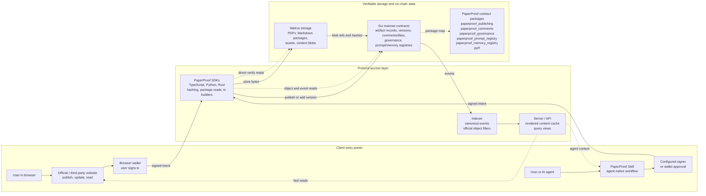
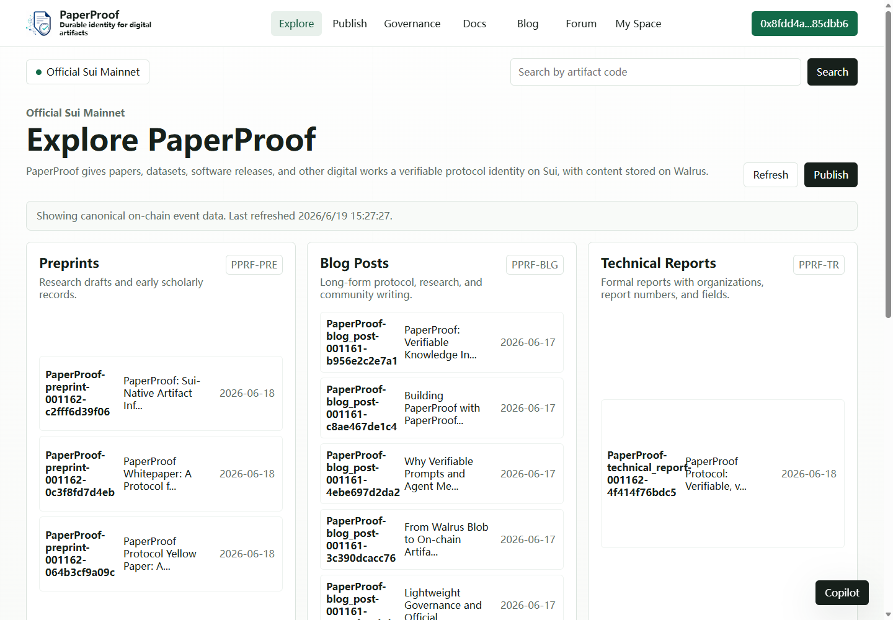
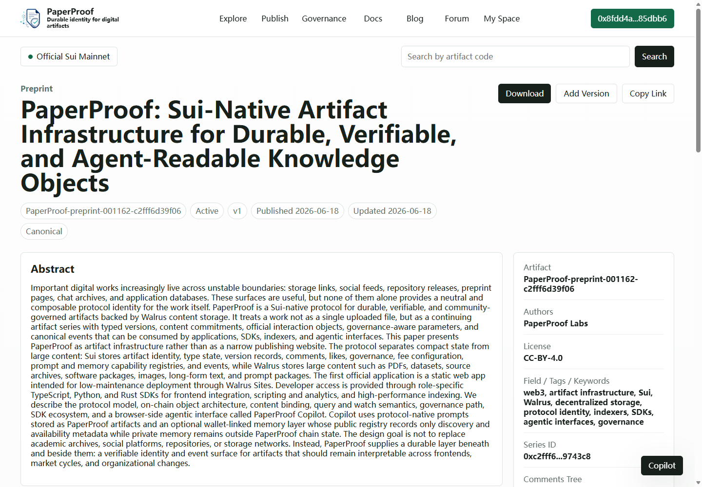
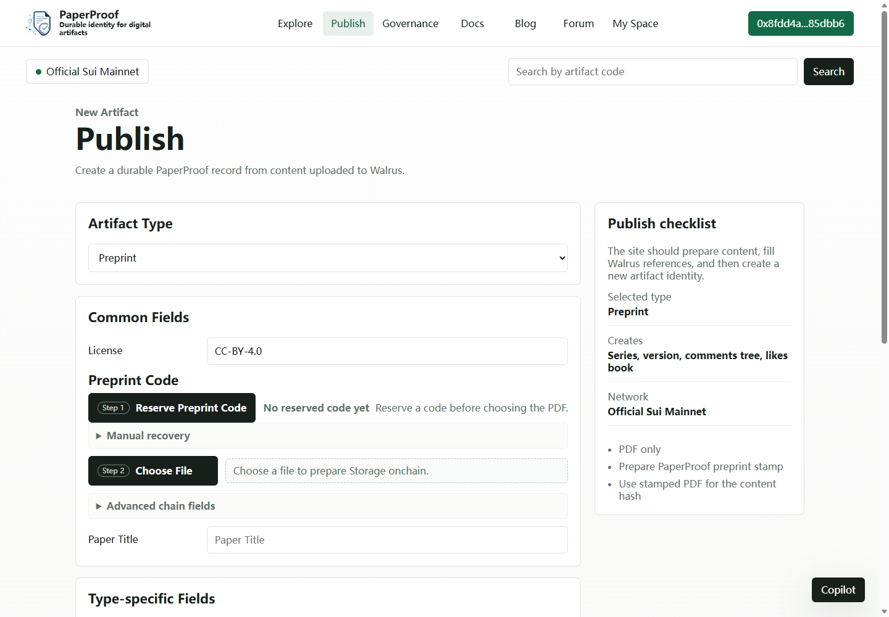
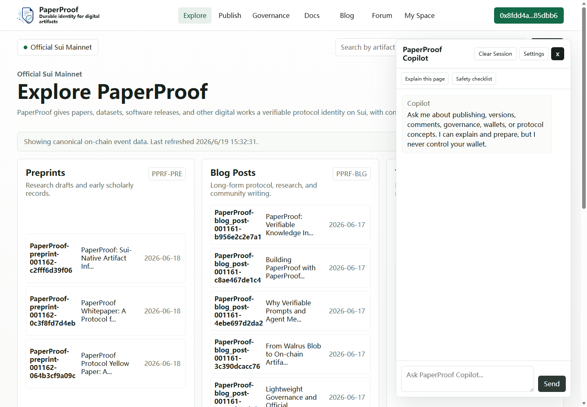
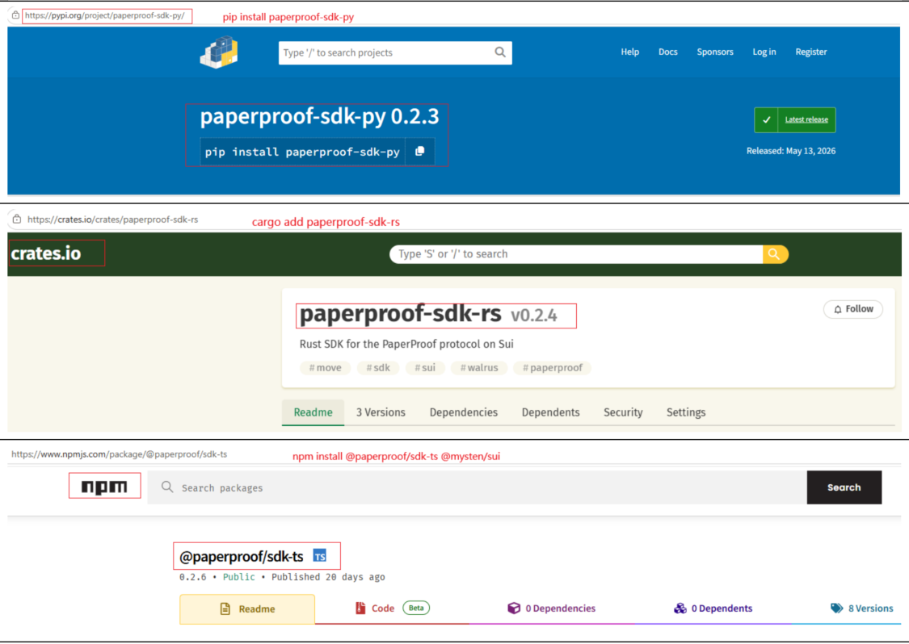
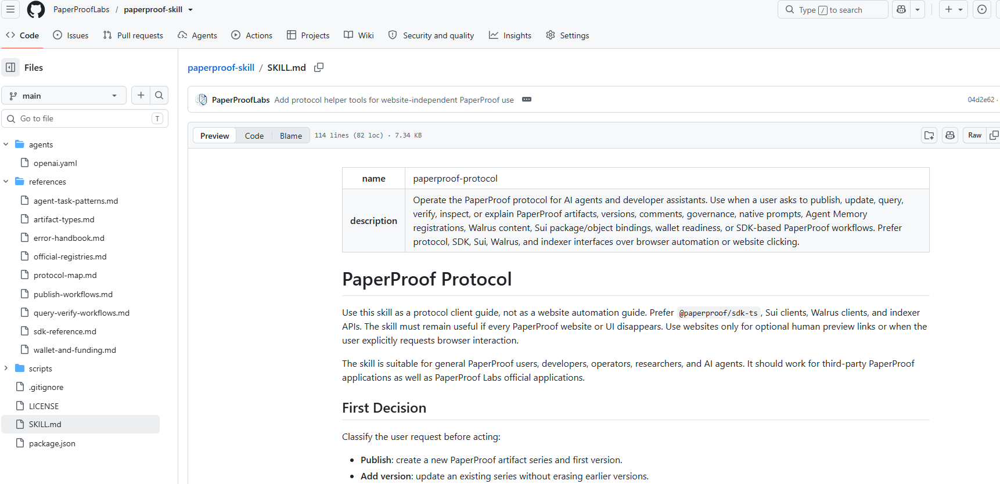

# PaperProof Protocol - Sui Overflow 2026 Submission

> **Git-style provenance for durable knowledge artifacts.** PaperProof turns
> papers, datasets, technical reports, software releases, docs, blogs, forums,
> and AI-generated outputs into versioned protocol artifacts anchored on Sui and
> backed by Walrus.

[](https://paperproof.site/)
[](https://www.youtube.com/watch?v=bIRykM53iFA)
[](deployments/README.md)
[](docs/ARCHITECTURE.md)
[](https://github.com/PaperProofLabs/paperproof-community-skill)

PaperProof is a live **mainnet provenance layer for durable knowledge artifacts
on Sui and Walrus**. Each artifact gets a stable Sui identity, typed version
history, content commitments, Walrus storage references, protocol events,
community interaction surfaces, SDK access, and agent-native operation.

This repository is the judge-facing entry point for the PaperProof submission.
The production implementation lives in focused repositories under the
[PaperProofLabs GitHub organization](https://github.com/PaperProofLabs); this
hub is the fast path to the live app, contracts, SDKs, Skill, papers, slides,
screenshots, demo video, and mainnet deployment evidence.

## Protocol Flow at a Glance



The indexer and server make shared public pages fast, but they are not the
trust root. Verification resolves back to configured Sui package IDs, artifact
objects, content hashes, and Walrus blob references.

## Judge Quick View

| Area | Evidence |
| --- | --- |
| Live product | [paperproof.site](https://paperproof.site/) with artifact exploration, publishing, version history, docs, blog, forum, governance, comments, likes, and Copilot-assisted workflows. |
| Demo video | [YouTube demo walkthrough](https://www.youtube.com/watch?v=bIRykM53iFA). |
| Mainnet package for forms | `0xc9a75e4514db2a37df6f95b4e2b329c065ac6089953bd2c1c0a0c389835bd3d8` |
| Mainnet packages | Publishing, comments, governance, PPRF, prompt registry, and Agent Memory registry; see [deployments/README.md](deployments/README.md). |
| Walrus usage | Durable content layer for artifact bytes, docs, blogs, forum posts, papers, slides, datasets, and release packages. |
| Self-dogfooding | PaperProof's own papers, slides, Skill releases, docs, blog, forum posts, SDK releases, and datasets are represented as PaperProof artifacts. |
| SDKs | Published on [npm](https://www.npmjs.com/package/@paperproof/sdk-ts), [PyPI](https://pypi.org/project/paperproof-sdk-py/), and [crates.io](https://crates.io/crates/paperproof-sdk-rs). |
| AI/Agent | Configurable website Copilot with MemWal-backed memory plus the external [PaperProof Skill](https://github.com/PaperProofLabs/paperproof-community-skill). |
| Safety | OpenZeppelin-style `two_step_transfer`, source-available Move contracts, tests, and a separate [Sui Prover formal-verification branch](https://github.com/PaperProofLabs/paperproof-contracts/tree/formal-verification-merge). |
| Pitch deck | [paperproof-slides.pdf](https://github.com/PaperProofLabs/paperproof-slides/blob/main/paperproof-slides.pdf). |

## Zero-Install Judge Path

Judges do not need a wallet, private key, local Sui CLI, local Walrus client, or
developer environment to verify the core submission evidence.

| Step | Open | What to verify |
| --- | --- | --- |
| 1 | [Live website](https://paperproof.site/) | The product is deployed and browsable. |
| 2 | A published artifact page | Metadata, downloads, version history, comments, likes, and explorer links are visible. |
| 3 | [Deployment notes](deployments/README.md) | Mainnet package IDs and shared object IDs are explicit. |
| 4 | [SuiVision](https://suivision.xyz/package/0xc9a75e4514db2a37df6f95b4e2b329c065ac6089953bd2c1c0a0c389835bd3d8) or [Suiscan](https://suiscan.xyz/mainnet/object/0xc9a75e4514db2a37df6f95b4e2b329c065ac6089953bd2c1c0a0c389835bd3d8) | The primary publishing package exists on Sui mainnet. |
| 5 | [YouTube demo](https://www.youtube.com/watch?v=bIRykM53iFA) | Publishing, adding versions, browsing artifacts, comments, packages, docs, blog, forum, and closing slides are demonstrated. |
| 6 | [SDK releases](#project-completeness) and [PaperProof Skill](https://github.com/PaperProofLabs/paperproof-community-skill) | Developers and AI agents have public integration surfaces. |

## What Judges Can Verify in 5 Minutes

1. Open [paperproof.site](https://paperproof.site/) and browse artifact types:
   preprints, technical reports, datasets, software releases, blogs, and forum
   content.
2. Open a real artifact page, inspect metadata, downloads, version history,
   comments, likes, and explorer links.
3. Check the primary Sui mainnet publishing package:
   [SuiVision](https://suivision.xyz/package/0xc9a75e4514db2a37df6f95b4e2b329c065ac6089953bd2c1c0a0c389835bd3d8)
   or [Suiscan](https://suiscan.xyz/mainnet/object/0xc9a75e4514db2a37df6f95b4e2b329c065ac6089953bd2c1c0a0c389835bd3d8).
4. Review the public SDK releases on npm, PyPI, and crates.io.
5. Inspect the [PaperProof Skill](https://github.com/PaperProofLabs/paperproof-community-skill)
   and the website Copilot docs to see how AI agents can operate the protocol.
6. Open the [demo video](https://www.youtube.com/watch?v=bIRykM53iFA),
   [slides](https://github.com/PaperProofLabs/paperproof-slides/blob/main/paperproof-slides.pdf),
   and [deployment notes](deployments/README.md) for the full verification path.

## Protocol Surfaces

PaperProof is not tied to one website. The same artifact state is usable by
humans, developers, indexers, communities, and AI agents.

| Surface | Human use | Developer use | Agent use | Verification anchor |
| --- | --- | --- | --- | --- |
| Website | Browse, publish, add versions, comment, read docs/blog/forum. | Reference portal for UX and app behavior. | Copilot helps users prepare metadata and reason about artifacts. | Explorer links, hashes, version records, and Walrus references. |
| SDKs | Indirect through apps and scripts. | TypeScript, Python, and Rust integrations for portals, services, dashboards, and analytics. | Programmatic query, packaging, and verification building blocks. | Mainnet constants, events, object reads, and content hashes. |
| PaperProof Skill | Lowers operational complexity through AI-assisted workflows. | Reusable agent workflow layer for publish/update/query/verify/cite operations. | Direct protocol operation by AI agents. | Sui transactions plus Walrus-backed content commitments. |
| Indexer | Fast public pages for shared content. | Query acceleration for apps and dashboards. | Fast retrieval context for agent workflows. | Not the trust root; Sui and Walrus remain canonical. |

## Visual Proof

| Surface | Screenshot |
| --- | --- |
| Explore and artifact discovery |  |
| Published artifact detail |  |
| Publish workflow |  |
| Copilot |  |
| Three SDK releases |  |
| PaperProof Skill repo |  |

More screenshots are indexed in [screenshots/README.md](screenshots/README.md).

## Why PaperProof

Important knowledge should not live as fragile links, mutable file URLs, or
isolated database rows. Papers, datasets, releases, reports, audit trails, docs,
forum discussions, and AI-generated outputs need identity, versioning,
verification, citation, and community context that survive application changes.

PaperProof adds that missing protocol layer:

- `ArtifactSeries` objects provide stable Sui identity across versions.
- Every version binds metadata, content hash, content type, and Walrus storage
  references to protocol state.
- Comments, likes, governance, prompt registry, and Agent Memory registry are
  modeled as protocol surfaces rather than app-only data.
- SDKs let developers build portals, indexers, bots, dashboards, and research
  tooling without scraping web pages.
- The PaperProof Skill and website Copilot lower the operational barrier for
  users and AI agents while keeping final state verifiable on Sui and Walrus.

## Why Sui

PaperProof uses Sui where object-centric blockchain design matters: durable
artifact identities, version records, permissions, community interaction
objects, governance state, registry objects, and indexer-friendly events.

| Protocol surface | Sui role |
| --- | --- |
| Publishing | Stable artifact series, typed version lineage, content commitments, metadata, and publication events. |
| Comments and likes | Interaction state bound to artifact series instead of detached website comments. |
| Governance | Managed protocol upgrades and configuration changes. |
| Prompt registry | Protocol-native prompt discovery for Copilot and agent workflows. |
| Agent Memory registry | Discovery surface for memory-related protocol objects and agent integrations. |
| PPRF | Protocol coin package used by the broader PaperProof system. |

If a hackathon form allows only one deployed package address, use the primary
publishing package:

```text
0xc9a75e4514db2a37df6f95b4e2b329c065ac6089953bd2c1c0a0c389835bd3d8
```

All package IDs and shared objects are listed in [deployments/README.md](deployments/README.md).

## Why Walrus

Walrus is not passive storage in PaperProof. It is the durable content layer for
versioned artifacts, while Sui provides identity, lineage, commitments,
permissions, governance, and public events.

This split gives PaperProof a practical verification architecture:

- Sui records artifact identity, version metadata, hashes, permissions, and
  events.
- Walrus stores large artifact content such as PDFs, markdown packages, release
  archives, datasets, screenshots, docs, blogs, and forum content.
- Server-side indexing makes shared public pages fast to browse, while the
  underlying bytes remain Walrus-backed and verifiable.
- Website, SDKs, and Skill connect the layers so users can publish, retrieve,
  cite, and verify artifacts without manually handling every storage detail.

## Agent-Native by Design

PaperProof has two complementary agent interfaces:

| Interface | What it does |
| --- | --- |
| Website Copilot | Configurable model-provider Copilot that helps users understand the protocol, discover artifacts, prepare metadata, add versions, and reason about verification. It uses MemWal-backed memory to preserve useful task context across sessions. |
| PaperProof Skill | Community-facing AI/agent Skill for protocol-native publish, update, query, package, upload, transaction, and verification workflows. |

PaperProof can preserve agent memory outputs, but its scope is broader: it is a
protocol for durable knowledge artifacts across humans, software, research,
communities, websites, SDKs, and external AI agents.

## Project Completeness

PaperProof is submitted as a working multi-component system, not a single mockup
or isolated contract demo.

| Component | Status |
| --- | --- |
| Live website | [https://paperproof.site/](https://paperproof.site/) |
| Sui mainnet contracts | Deployed; see [deployment notes](deployments/README.md) |
| Walrus content workflow | Used for artifact content, docs, blogs, forum content, and version records |
| TypeScript SDK | Published on [npm](https://www.npmjs.com/package/@paperproof/sdk-ts) |
| Python SDK | Published on [PyPI](https://pypi.org/project/paperproof-sdk-py/) |
| Rust SDK | Published on [crates.io](https://crates.io/crates/paperproof-sdk-rs) |
| Skill for AI/Agent | [PaperProof Skill](https://github.com/PaperProofLabs/paperproof-community-skill) |
| Website Copilot | Configurable model provider + MemWal-backed memory |
| Contracts | [paperproof-contracts](https://github.com/PaperProofLabs/paperproof-contracts) |
| Formal verification by Sui Prover | [paperproof-contracts/formal-verification-merge](https://github.com/PaperProofLabs/paperproof-contracts/tree/formal-verification-merge) |
| Papers | [whitepaper, yellow paper, academic paper](https://github.com/PaperProofLabs/paperproof-papers) |
| Slides | [paperproof-slides](https://github.com/PaperProofLabs/paperproof-slides) |
| Demo video | [YouTube](https://www.youtube.com/watch?v=bIRykM53iFA) |

## Repository Map

This is intentionally a link-index submission hub, not a stale copied monorepo.
Each implementation repository remains canonical for its component.

| Area | Repository | What judges should look for |
| --- | --- | --- |
| Sui Move contracts | [paperproof-contracts](https://github.com/PaperProofLabs/paperproof-contracts) | Publishing, comments, governance, PPRF, prompt registry, Agent Memory registry, tests, and deployment constants. |
| Formal verification | [formal-verification-merge](https://github.com/PaperProofLabs/paperproof-contracts/tree/formal-verification-merge) | Sui Prover specifications for selected publishing, governance, and comments behavior. |
| Official website | [paperproof-app](https://github.com/PaperProofLabs/paperproof-app) | Artifact exploration, publish/update workflows, docs/blog/forum rendering, governance, Copilot, and server-side indexed content. |
| Reference indexer | [paperproof-indexer-reference](https://github.com/PaperProofLabs/paperproof-indexer-reference) | Event ingestion and query acceleration for app-facing content. |
| TypeScript SDK | [paperproof-sdk-ts](https://github.com/PaperProofLabs/paperproof-sdk-ts) | Browser/Node SDK, transaction helpers, query providers, event parsing. |
| Python SDK | [paperproof-sdk-py](https://github.com/PaperProofLabs/paperproof-sdk-py) | Python scripting, notebooks, analytics, export, and automation. |
| Rust SDK | [paperproof-sdk-rs](https://github.com/PaperProofLabs/paperproof-sdk-rs) | Service/indexer-oriented SDK for high-throughput integrations. |
| Agent skill | [paperproof-community-skill](https://github.com/PaperProofLabs/paperproof-community-skill) | Agent-native publish, update, verify, cite, and package workflows. |
| Docs and screenshots | [paperproof-docs](https://github.com/PaperProofLabs/paperproof-docs) | Official docs, screenshots, blog/forum content, skills, and research notes. |
| Papers | [paperproof-papers](https://github.com/PaperProofLabs/paperproof-papers) | Whitepaper, yellow paper, academic paper, figures, and compiled PDFs. |
| Slides | [paperproof-slides](https://github.com/PaperProofLabs/paperproof-slides) | Pitch deck and architecture figures. |

See [REPOS.md](REPOS.md) for the fuller component-by-component map.

## Start Here

| Goal | Link |
| --- | --- |
| Try the product | [paperproof.site](https://paperproof.site/) |
| Watch the demo | [YouTube demo video](https://www.youtube.com/watch?v=bIRykM53iFA) |
| Inspect mainnet deployment | [deployments/README.md](deployments/README.md) |
| Understand the architecture | [docs/ARCHITECTURE.md](docs/ARCHITECTURE.md) |
| Review project overview | [docs/PROJECT_OVERVIEW.md](docs/PROJECT_OVERVIEW.md) |
| Check repository map | [REPOS.md](REPOS.md) |
| Follow evidence checklist | [evidence/EVIDENCE_CHECKLIST.md](evidence/EVIDENCE_CHECKLIST.md) |
| Review judging checklist | [SUBMISSION_CHECKLIST.md](SUBMISSION_CHECKLIST.md) |
| Browse screenshots | [screenshots/README.md](screenshots/README.md) |

## Submission Materials

- [Project overview](docs/PROJECT_OVERVIEW.md)
- [Architecture](docs/ARCHITECTURE.md)
- [Repository map](REPOS.md)
- [Deployment notes](deployments/README.md)
- [Demo script](demo/DEMO_SCRIPT.md)
- [Evidence checklist](evidence/EVIDENCE_CHECKLIST.md)
- [Judging checklist](SUBMISSION_CHECKLIST.md)
- [Legal and safety boundaries](docs/LEGAL_AND_SAFETY_BOUNDARIES.md)

## License and Notice

This submission repository is governed by [LICENSE.md](LICENSE.md) and
[NOTICE.md](NOTICE.md). Linked repositories and packages are governed by their
own licenses.

PaperProof smart contract source code is source-available. Public availability
supports transparency, review, research, and interoperability, but does not
grant rights to copy, modify, redeploy, or commercialize the contract source
except as expressly permitted by the relevant contract license.

For user-content, app-display, takedown, wallet, AI, and risk boundaries, see
[docs/LEGAL_AND_SAFETY_BOUNDARIES.md](docs/LEGAL_AND_SAFETY_BOUNDARIES.md).
