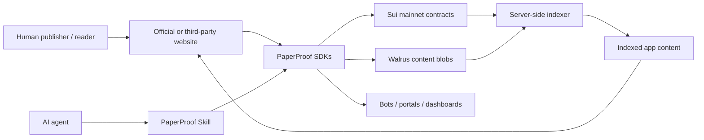

# Architecture

PaperProof combines Sui protocol objects, Walrus content storage, server-side
indexing, the official website, published SDKs, and agent-facing workflows into
one verification-oriented artifact stack.

## One-Screen Architecture

## What Each Layer Does

| Layer | Responsibility | Trust role |
| --- | --- | --- |
| Sui mainnet contracts | Artifact identity, version lineage, package IDs, governance, comments, likes, registries, and canonical events. | Source of truth for protocol state. |
| Walrus | Large artifact bytes: PDFs, markdown packages, release archives, datasets, docs, blogs, forum content, screenshots, and other durable payloads. | Durable content layer bound to Sui by hashes and blob references. |
| Server-side indexer | Tracks Sui events, pulls shared public content, parses docs/blog/forum/artifacts, and exposes fast query surfaces. | Query acceleration, not the trust root. |
| paperproof-app | Official website for browsing, publishing, adding versions, commenting, governance, docs, blog, forum, and Copilot workflows. | User-facing access layer. |
| SDKs | TypeScript, Python, and Rust interfaces for applications, scripts, notebooks, services, and indexers. | Developer-facing access layer. |
| PaperProof Skill | AI/agent workflow for publish, update, package, upload, query, verify, and cite operations. | Agent-facing access layer. |
| Copilot | Configurable website assistant with MemWal-backed memory. | Human-assistance layer for protocol workflows. |

## On-Chain Object Model

The core publishing package anchors durable artifact identity and versioning.
Supporting packages provide comments, governance, PPRF, prompt registry, and
Agent Memory registry functions.

- `PaperProofRoot` records protocol-level roots and capabilities.
- `TypeRegistry` and type indexes define enabled artifact categories.
- `ArtifactSeries` is the stable identity for a work across versions.
- Version records bind typed metadata, content hash, content type, Walrus blob
  ID, and Walrus blob object ID.
- `CommentsTree` and `LikesBook` provide interaction state bound to a series.
- Governance objects support managed protocol updates and proposal workflows.
- Registry objects support protocol-native prompts and Agent Memory discovery.

`TypeRegistry` records enabled artifact types and TypeIndex IDs. It does not
directly own all `ArtifactSeries` objects. Each `ArtifactSeries` stores its
artifact type, and indexers rebuild artifact discovery from emitted events.

## Walrus Content Flow

1. A publisher prepares an artifact payload such as a PDF, markdown package,
   release archive, dataset, blog post, forum post, or documentation bundle.
2. The website, SDK, or Skill uploads the large content to Walrus.
3. PaperProof records the content hash, content type, Walrus blob reference,
   metadata, and version lineage on Sui.
4. The indexer follows protocol events, pulls shared public content, parses it
   for website use, and stores query-friendly representations.
5. Readers browse fast indexed pages while verification can still resolve back
   to Sui package IDs, artifact objects, hashes, and Walrus content bytes.

## SDK Architecture

- TypeScript SDK: website integration, browser wallet flows, Node.js scripts,
  transaction helpers, query providers, and event parsing.
- Python SDK: notebooks, CSV/JSON export, analytics scripts, and automation.
- Rust SDK: services, checkpoint ingestion, database sinks, and high-throughput
  indexers.

All three SDKs are published publicly and point to the same mainnet deployment
constants.

## Agent-Native Architecture

PaperProof exposes the same protocol through two agent-facing surfaces:

- The website Copilot helps humans discover artifacts, prepare metadata, add
  versions, and reason about verification results. It can be configured with
  different model providers and uses MemWal-backed memory for cross-session
  context.
- The PaperProof Skill lets external AI agents operate the protocol directly,
  including packaging local content, uploading to Walrus, submitting Sui
  transactions, and verifying results.

## Trust and Safety Model

PaperProof does not ask users to trust the website as the protocol boundary.
The website is an access layer; protocol state lives on Sui, while large
artifact bytes live in Walrus.

Critical checks should verify that:

1. Events and objects come from configured PaperProof package IDs.
2. Artifact series and version objects match the expected type and lineage.
3. Downloaded bytes match recorded content hashes.
4. Walrus blob references correspond to the version record.
5. Comments, likes, governance state, prompt registry, and memory registry data
   are read from the configured protocol packages and shared objects.

The server-side indexer improves user experience, but it is not the trust root.
