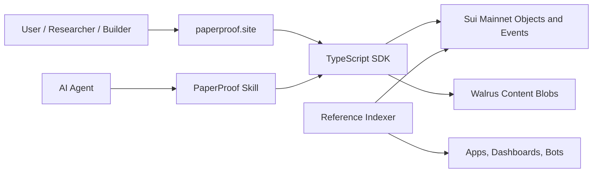

# Architecture

## High-Level Architecture

PaperProof combines Sui protocol objects, Walrus content storage, a static web
app, SDKs, and an agent-facing Skill into one verification-oriented artifact
stack.

## On-Chain Object Model

The core publishing package anchors durable artifact identity and versioning.
Supporting packages provide comments, governance, PPRF, prompt registry, and
Agent Memory registry functions.

- `PaperProofRoot` records protocol-level roots and capabilities.
- `TypeRegistry` and type indexes define enabled artifact categories.
- `ArtifactSeries` is the stable identity for a work across versions.
- Version records bind typed metadata, content hash, content type, Walrus blob
  ID, and Walrus blob object ID.
- `CommentsTree` and `LikesBook` provide interaction state bound to a series.
- Governance objects support managed protocol updates and proposal workflows.
- Registry objects support protocol-native prompts and Agent Memory discovery.

`TypeRegistry` records enabled artifact types and TypeIndex IDs. It does not
directly own all `ArtifactSeries` objects. Each `ArtifactSeries` stores its
artifact type, and indexers rebuild artifact discovery from emitted events.

## SDK Architecture

- TypeScript SDK: website integration, browser wallet flows, Node.js scripts,
  transaction helpers, query providers, and event parsing.
- Python SDK: notebooks, CSV/JSON export, analytics scripts, and automation.
- Rust SDK: services, checkpoint ingestion, database sinks, and high-throughput
  indexers.

All three SDKs are published publicly and point to the same mainnet deployment
constants.

## Query and Indexing Strategy

Sui objects and canonical events are the source of truth. The website and
indexers make the data easier to explore, but critical checks should resolve
series/version objects and verify package IDs, content hashes, and Walrus blob
references.

## Trust and Safety Model

PaperProof does not ask users to trust the website as the protocol boundary.
The website is an access layer; the protocol state lives on Sui, while large
artifact bytes live in Walrus. SDKs and agents should verify that events come
from configured PaperProof packages and that downloaded bytes match recorded
content hashes.
